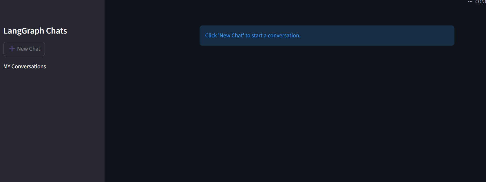
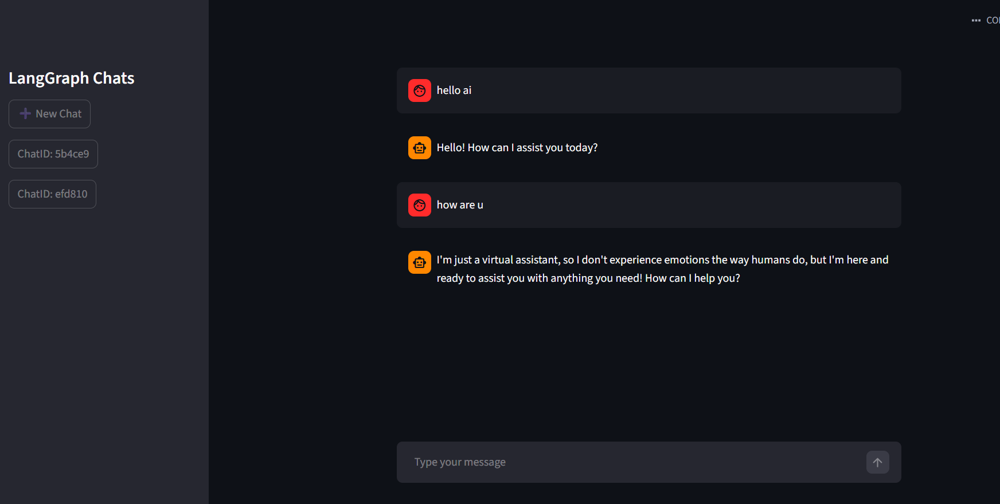

# Chatbot using LangGraph

A **chatbot application** built with **LangGraph** and **Streamlit**, allowing users to chat, create new sessions, resume previous chats, and see streaming responses in real-time. Uses **InMemorySave** for temporary memory and session checkpointing.

---

## Features

- **New Chat:** Start a fresh chat session.
- **Resume Chat:** Continue previous conversations.
- **Streaming Responses:** Messages appear in real-time as the AI responds.
- **Temporary Memory:** Session-specific memory using **InMemorySave**.
- **Checkpointer:** Temporary storage for chat state between sessions.

---

## Technology Stack

- **Frontend:** [Streamlit](https://streamlit.io)  
- **Backend / Core Logic:** [LangGraph](https://www.langgraph.com)  
- **Memory Management:** InMemorySave  
- **Programming Language:** Python  

---

## Installation

1. **Clone the repository**

```bash
git clone https://github.com/yourusername/langgraph-chatbot.git
cd langgraph-chatbot

```

2. **Create a .env file**

```bash
  OPENAI_API_KEY=your api key
 ```
3. **Run Stramlit**
```bash
streamlit run .\streamlit_frontend_resume.py

```

## Screenshots

**Chat Interface**


**Chats**



